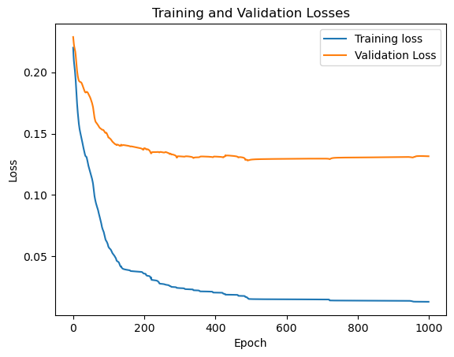
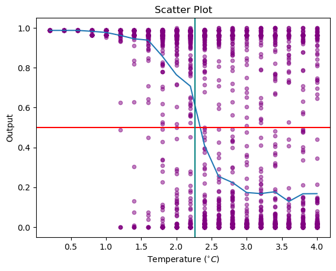

## Introduction
This statistical mechanics model aims to classify phases of the 2-dimensional (2D) 10 x 10 grid Ising Model of ferromagnetism using a **Feedforward Neural Network** (FNN) built from scratch with no PyTorch/TensorFlow. The FNN was trained on spin configurations from the 2D Ising model data provided by [Min Long](https://github.com/DavidGoing). 

The 2D Ising model exhibits a phase transition at a **critical temperature ($T_c ≈ 2.269$)**, transitioning from disordered paramagnetic phase at high temperatures to ordered ferromagnetic phase at low temperature, with spontaneous magnetization. Below the critical temperature, the spins spontaneously align, while above it, thermal fluctuations destroy the spontaneous magnetization.

For more information about the 2D Ising Model, here is the reference from Stanford University: http://micro.stanford.edu/~caiwei/me334/Chap12_Ising_Model_v04.pdf. This document covers the definition of the Ising model, solving the 1D Ising model, and the 2D Ising model, including its analytic solution, Monte Carlo simulation, and qualitative behavior.

## Dataset and Network Structure
The dataset consists of 6000 spin configurations, obtained by Monte Carlo simulation, of the 2D 10 x 10 grid Ising Model. The spin configurations cover a temperature range from 0.2 to 4.0, where temperatures below the critical temperature $T_c$ were labeled as 1 (ordered phase), otherwise were labeled as 0 (disordered phase). Note that 1000 configurations were used for training, and the remaining 5000 configurations were for evaluating the trained model. 

**Our network has an input layer of 100 neurons, a hidden layer of 3 neurons with sigmoid activations, and an output layer of 1 neuron, also with a sigmoid activation.** Note that the network uses mean squared error as the loss function and does not include any regularization or random dropout.

## Results
The first image shows the training and validation losses for the neural network model over the training epochs. The second image includes two visualizations:
* A scatter plot of the final output values of all 6000 configurations against temperature.
* The mean value of all points with the same temperature.

 
