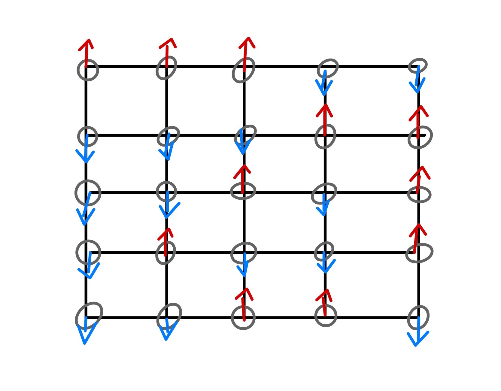
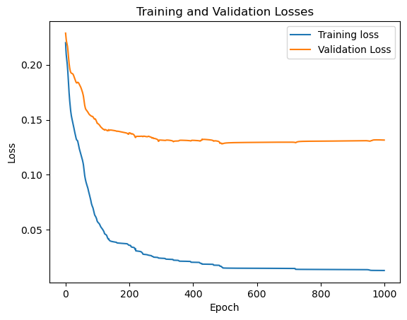
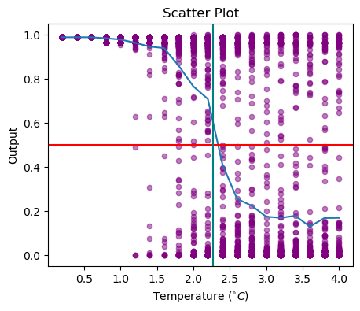

<p align="center">
  
</p>

## Introduction
This statistical mechanics model aims to classify phases of the 2-dimensional (2D) 10 x 10 grid Ising model of ferromagnetism using a **Feedforward Neural Network (FNN) built from scratch with no PyTorch/TensorFlow**. The FNN was trained on spin configurations of the 2D Ising model data provided by [Min Long](https://github.com/DavidGoing). 

The 2D Ising model exhibits a phase transition at a **critical temperature ($T_c ≈ 2.269$)**, transitioning from disordered paramagnetic phase at high temperatures to ordered ferromagnetic phase at low temperature, with spontaneous magnetization. Below the critical temperature, the spins tend to align spontaneously, while above it, thermal fluctuations destroy the spontaneous magnetization.

For more information about the 2D Ising Model, here is the reference from Stanford University: http://micro.stanford.edu/~caiwei/me334/Chap12_Ising_Model_v04.pdf. This document covers the definition of the Ising model, solving the 1D Ising model, and the 2D Ising model, including its analytic solution, Monte Carlo simulation, and qualitative behavior.

## Dataset and Network Structure
The dataset consists of 6000 spin configurations, obtained by Monte Carlo simulation, of the 2D 10 x 10 grid Ising Model. The spin configurations cover a temperature range from 0.2 to 4.0, where temperatures below the critical temperature $T_c$ were labeled as 1 (ordered phase), otherwise were labeled as 0 (disordered phase). Note that 1000 configurations were used for training, and the remaining 5000 configurations were for evaluating the trained model. 

**Our network has an input layer of 100 neurons, a hidden layer of 3 neurons with sigmoid activations, and an output layer of 1 neuron, also with a sigmoid activation.** Note that the network uses mean squared error as the loss function and does not include any regularization or random dropout.

## Code
We only show the code for the construction of the feedforward neural network. The full code can be found in `index.ipynb`.
```python
# diff = True => return derivative of sigmoid
def sigmoid(z, diff = False):
    if diff == False:
        return 1.0/(1.0+np.exp(-z))
    else: 
        return sigmoid(z)*(1-sigmoid(z))
```
```python
class Network:
    
    # sizes = [2,2,1] => 2 input neurons + 2 hidden neurons + 1 output neuron
    def __init__(self, sizes): 
        self.num_layers = len(sizes)
        self.sizes = sizes
        self.biases = [np.random.randn(y, 1) for y in sizes[1:]] # initialize the weights and biases
        self.weights = [np.random.randn(y, x)
                        for x, y in zip(sizes[:-1], sizes[1:])]
    
    # forward propagation # x is input
    # activations_zs = True => return the lists of activations and logits in that forward propagation
    def forward_propagation(self, x, activations_zs = False):
        x = x.reshape((self.sizes[0],1))
        zs = []
        activations = [x]
        a = x
        
        for w, b in zip(self.weights, self.biases):
            z = (w @ a) + b
            zs.append(z)
            a = sigmoid(z)
            activations.append(a)
            
        if activations_zs == True:
            return a, activations, zs
        else:
            return a
    
    # return dJ/dtheta for every weights and biases through one back propagration
    # activations and zs from forward propagation are required
    def back_propagration(self, y, activations, zs):
        dJdthe_b = [np.zeros(b.shape) for b in self.biases]
        dJdthe_w = [np.zeros(w.shape) for w in self.weights]
                        
        # back propagration => obtain dJdthe_w and dJdthe_b
        # last layer
        delta = ( activations[-1] - y ) * sigmoid(zs[-1], diff = True)
        dJdthe_b[-1] = delta 
        dJdthe_w[-1] = delta @ activations[-2].T
        
        # from second last layer to the front
        for layer in range(2, self.num_layers):
            delta = ( self.weights[-layer + 1].T @ delta ) * sigmoid(zs[-layer], diff = True)
            dJdthe_b[-layer] = delta 
            dJdthe_w[-layer] = delta @ activations[-layer - 1].T  
            
        return (dJdthe_w, dJdthe_b)
    
    # gradient descent 
    def optimization(self, X_train, Y_train, eta, epochs, calculate_cost = False, X_test = None, Y_test = None):
        
        start_time = time.time()
        
        train_costs = [] # train_costs calculated from training set 
        val_costs = [] # val__costs calculated from test set 
        
        for i in range(epochs):
            # loop over each examples in training set
            for x, y in zip(X_train, Y_train):

                # use forward_propagation and back_propagration to obtain the gradient of cost function
                a, activations, zs = self.forward_propagation(x, activations_zs =True)
                dJdthe_w, dJdthe_b = self.back_propagration(y, activations, zs)

                # update the weights and biases
                self.weights = [w - eta * dJ for w, dJ in zip(self.weights, dJdthe_w)]
                self.biases = [b - eta * dJ for b, dJ in zip(self.biases, dJdthe_b)]
            
            # store the cost for each iteration calculated from training set
            train_costs.append(self.mean_squared_error(X_train, Y_train))
            val_costs.append(self.mean_squared_error(X_test, Y_test))
            
            completion_per = (i + 1) / epochs * 100
            # check if the completion percentage is a multiple of 10
            if completion_per % 10 == 0:
                print("Epoch: {}/{} - {}% complete".format(i + 1, epochs, completion_per))
        
        end_time = time.time()
        elapsed_time = (end_time - start_time) / 60
        print('')
        print(f'Elapsed time: {elapsed_time:.2f}  minutes')

        if calculate_cost:
            return train_costs, val_costs
        
    #predict the output     
    def predict(self, X_test):
        results = []
        for x in X_test:
            a = self.forward_propagation(x)
            if a[0,0] >= 0.5:
                results.append(1)
            else:
                results.append(0)
        return np.array(results)
    
    # cost function is defined as mean squared error
    def mean_squared_error(self, X, Y):
        m = X.shape[0]
        outputs = []
        for x in X:
            output = self.forward_propagation(x)
            outputs.append(output[0,0])
        outputs = np.array(outputs)
        mse = sum((output - y) ** 2 for output, y in zip(outputs, Y)) / m
        return mse
```

## Results
The first image shows the training and validation losses for the neural network model over the training epochs. The second image includes two visualizations:
* A scatter plot of the final output values of all 6000 configurations against temperature.
* The mean value of all points with the same temperature.

 
